# 🏔 FMCG-Retail-SCM-case-study-using-Minitab-software
This repository presents a real-world **Make-To-Stock (MTS)** supply chain issue in an **Fast-Moving Consumer Goods (FMCG)** retail environment. Using SPC techniques, particularly **Control Charts** to assess inventory replenishment lead time stability

---

## 🚨 Control chart
Control chart plots and processes the input and output data over a period and connects the data points by a line in order to detect trends or unusual wents
### Characteristics
- They are similar to run or trend charts, with an addition of a control limit, line and an average or center line
- Control charts are used with discrete or continuous data
- Control limits (UCL & LCL) are typically set at approximately three standard deviations from the center line
- Specification limits (USL & LSL) normally do not appear on them
- Distribution of the process follows a normal distribution and for many processes the central limit thrown will be applied

Control charts are used when:
- Tracking Process Statistics over time
- Detecting the presence of special causes

Process is in control when:
- Most of the points fall within the bounds of the control limits
- Points do not display any non-random patterns
- Since the data is depicted visually in a control chart, it is easy to find the difference between common cause and special cause

### Setting the Control limits

```mermaid
flowchart TD;
A[Standard Control Chart] --> |Uses control limits| B[σₘₑₐₙ from the data grand average X̄];
```

- The probability of the out-of-control point when the process has not changed is 0.27%
- 99.73% of the data lies within three standard deviations from the mean
- If there is an increase in the point more than 2σ; the chance of type 1 or alpha error is high
- If there is an increase in the point more than 4σ; the chance of type 2 or beta error is high

Walter Shewart had set 3σ limits on control charst with the beliec that when the process goes beyond these limits, it needs correction

### Common rules for control chart analysis
An Out-Of-Control (OOC) condition is indicated if one of the following is true:
1. 1 point is outside the control limit (above UCL/below LCL)
-          p(f) = 0.27%
2. 8 consecutive points are able CL or consecutively below the CL
-          p(f) = (0.5)⁸ = 0.39%
3. 6 to 8 points are consecutively increasing or decreasing
-          p(f) = (0.5)⁶*(0.5)⁸
4. 2 out of 3 points are within 1σₘₑₐₙ of either the UCL/the LCL
-          p(f) = 3!/(2!*1!)*(0.023)²*(0.477) = 0.08% for one side

### Tips
- Identify the purpose for data collection and try to determine what kind of data may be needed for measurement
- Identify measures that are used daily
- If you don't adapt data to filter any noise factors from the process, the control chart will show you wrong results

---

## 🎙 Choosing an appropriate Control chart

```mermaid
flowchart TD;
A[Continuous data sampling] --> |pulling one sample at fixed frequency| B[Individual Data Points];
A --> |Taking periodic group data| C[Subgroups];
B --> |Depicts the variability of individual characterisitics over time| D[I-MR chart];
C --> |2<n<9| E[X̄ & R chart];
C --> |when σ is calculated & n≥10| F[X̄ & S chart];
```

---
      
## ⚖️ X̄ chart principles
X̄ -> average of each subgroup of data

X̄ chart -> the subgroup average data will be plotted

## X̄ chart
- It is a plot of the means of the subgrouped data
- It shows inter sub-group or between subgroup variation
- The control limits are calculated based on mean of means, range or standard deviation, and other factors

## R chart
- It is the plot of the value of subgroup range
- The R chart shows intra subgroup
- One of the most sensitive charts to track and identify specific causes of variation
- Can be plotted with any type of data

## S chart
- It is the plot of the standard deviation of the subgroup range
- One of the most sensitive charts to track and identify special causes of variation

## X̄ & R chart
- It is of the same subgrouped data as the X̄ & S chart
- One chart is the X̄ and the other is the R chart
- Can be plotted with any type of data

## X̄ & S chart
- It is of the same subgrouped data as the X̄ & R chart
- One chart is the X̄ and the otehr is the S chart
- Can be plotted with any type of data

---

## 🧴 Control Limit Formulae
### X̄ & R charts
|*Center line*|*Control Limits*|
