# 🏔 FMCG-Retail-SCM-case-study-using-Minitab-software
This repository presents a real-world **Make-To-Stock (MTS)** supply chain issue in an **Fast-Moving Consumer Goods (FMCG)** retail environment. Using SPC techniques, particularly **Control Charts** to assess inventory replenishment lead time stability

---

## 🚨 Control chart
Control chart plots and processes the input and output data over a period and connects the data points by a line in order to detect trends or unusual wents
### Characteristics
- They are similar to run or trend charts, with an addition of a control limit, line and an average or center line
- Control charts are used with discrete or continuous data
- Control limits (UCL & LCL) are typically set at approximately three standard deviations from the center line
- Specification limits (USL & LSL) normally do not appear on them
- Distribution of the process follows a normal distribution and for many processes the central limit thrown will be applied

Control charts are used when:
- Tracking Process Statistics over time
- Detecting the presence of special causes

Process is in control when:
- Most of the points fall within the bounds of the control limits
- Points do not display any non-random patterns
- Since the data is depicted visually in a control chart, it is easy to find the difference between common cause and special cause

### Setting the Control limits

```mermaid
flowchart TD;
A[Standard Control Chart] --> |Uses control limits| B[σₘₑₐₙ from the data grand average X̄];
```

- The probability of the out-of-control point when the process has not changed is 0.27%
- 99.73% of the data lies within three standard deviations from the mean
- If there is an increase in the point more than 2σ; the chance of type 1 or alpha error is high
- If there is an increase in the point more than 4σ; the chance of type 2 or beta error is high

Walter Shewart had set 3σ limits on control charst with the beliec that when the process goes beyond these limits, it needs correction

### Common rules for control chart analysis
An Out-Of-Control (OOC) condition is indicated if one of the following is true:
1. 1 point is outside the control limit (above UCL/below LCL)
-          p(f) = 0.27%
2. 8 consecutive points are able CL or consecutively below the CL
-          p(f) = (0.5)⁸ = 0.39%
3. 6 to 8 points are consecutively increasing or decreasing
-          p(f) = (0.5)⁶*(0.5)⁸
4. 2 out of 3 points are within 1σₘₑₐₙ of either the UCL/the LCL
-          p(f) = 3!/(2!*1!)*(0.023)²*(0.477) = 0.08% for one side

### Tips
- Identify the purpose for data collection and try to determine what kind of data may be needed for measurement
- Identify measures that are used daily
- If you don't adapt data to filter any noise factors from the process, the control chart will show you wrong results

---

## 🎙 Choosing an appropriate Control chart

```mermaid
flowchart TD;
A[Continuous data sampling] --> |pulling one sample at fixed frequency| B[Individual Data Points];
A --> |Taking periodic group data| C[Subgroups];
B --> |Depicts the variability of individual characterisitics over time| D[I-MR chart];
C --> |2<n<9| E[X̄ & R chart];
C --> |when σ is calculated & n≥10| F[X̄ & S chart];
```

---
      
## ⚖️ X̄ chart principles
X̄ -> average of each subgroup of data

X̄ chart -> the subgroup average data will be plotted

## X̄ chart
- It is a plot of the means of the subgrouped data
- It shows inter sub-group or between subgroup variation
- The control limits are calculated based on mean of means, range or standard deviation, and other factors

## R chart
- It is the plot of the value of subgroup range
- The R chart shows intra subgroup
- One of the most sensitive charts to track and identify specific causes of variation
- Can be plotted with any type of data

## S chart
- It is the plot of the standard deviation of the subgroup range
- One of the most sensitive charts to track and identify special causes of variation

## X̄ & R chart
- It is of the same subgrouped data as the X̄ & S chart
- One chart is the X̄ and the other is the R chart
- Can be plotted with any type of data

## X̄ & S chart
- It is of the same subgrouped data as the X̄ & R chart
- One chart is the X̄ and the otehr is the S chart
- Can be plotted with any type of data

---

## 🧴 Control Limit Formulae
### X̄ & R charts
|*Center line*|*Control Limits*|*σₓ*|
|-------------|----------------|----|
|CLₓ̄ = x̿ | UCLₓ̄ = x̿ + A₂r̄| LCLₓ̄ = x̿ - A₂r̄|r̄/D₂|
|CLᵣ = R | UCLᵣ = D₄r̄| LCLᵣ = D₃r̄|r̄/D₂|

*Defining UCL & LCL in X̄-R charts*
- x̿ = Grand average
- r̄ = Average of the range
- A₂, D₂, D₃, D₄ are values which can be taken from the control chart table

### X̄ & S charts
|*Center line*|*Control limits*|*σₓ*|
|-------------|----------------|----|
|CLₓ̄ = x̿ | UCLₓ̄  = x̿ + A₃ₛ̄| LCLₓ̄ = x̿ - A₃S̄| S̄/C₄|
|CLₛ = S̄ | UCLₛ = B₄S̄ | LCLₛ = B₃S̄| S̄/C₄|

*Defining UCL & LCL in X̄-S charts*
- s => standard deviation of each subgroup data
- The data is divided into subgroups
- Standard deviation is calculated for each subgroup
- Values for A₃, B₃, B₄ are constant and are taken from control chart table. X̄-S charts are used to track process variation where the subgroup sample size ≥ 9

---

## 🚤 I-MR chart principles

It is used:
- When subgroup variation = 0 or no subgroup exists
- With data points from destructive testing or batch processing, or summary data from a time period

- It is sensitive to trends, cycles, patterns and normality

Control limits of the I-MR charts are calculated using a similar method as X̄ & R chart
|*Center line*|*Control limits*|
|-------------|----------------|
|CLₓ = X̄ | UCLₓ = X̄ + E₂r̄ | LCLₓ = X̄ - E₂r̄ |
|CLᵣ = r̄ | UCLᵣ = D₄r̄ | LCLᵣ = D₅r̄ |

*Example*: The QC department measures the strength of its milk cartons once in every hour. Is the process in control?
- Since the data is individual data, the I-MR chart will be used here
- This is a destructive test
- If several samples are tested, an X̄ & R chart can also be used
- Moving range is the absolute value of difference b/w las two data points

---

## 🛟 Control charts for attribute data
Based on sample size and data type (defects or defective), the control charts can be selected. The control limits may be constant, such as X̄ and R charts (for np & c charts), or vary depending on sample size (for p & u charts)

np -> If the sample size is consistent and data type is defective
c -> If the sample size is consistent and the data type available changes from defective to defects
p -> If the sample size is inconsistent and the data type is defective
u -> If the sample size is inconsistent and the data type is defect

### np-Chart principles
The np chart is used to measure the non-confirming proportions or no. of defectives within a standardize group size
- The expectation is that the same proportion exists in each group
- The np chart follows binomial distribution
- Large subgroups are required (50 minimum) for this chart
- Subgroup size must be constant
- Control limits will be constant for an np chart
  - Proportion of p = D/n
  - np = n*D/n = D
  - Control limits = np̄ ± 3√np̄ (1-p̄)
  -                   D = Defectives

**Eg**: *The sourcing department at Starbucks Coffee house worldwide measures 125 POs daily and records the no. of entry errors in them, Is the order entry process in control?*

### p-Chart principles
- The p-chart is used to measure the non-confirming proportion or defectives
- The expectation is that the same proportion exists in each group
- The p-chart follows binomial distribution
- The subgroup size should be atleast 50
- Subgroup size need not be constant
- Control limits may vary from subgroup to subgroup based on the subgroup size
- Control limits = p̄ ± 3√p̄(1-p̄)/n
-                   When n changes, control limit also changes

**Eg**: *The sourcing department in Starbuck Coffee house worldwide measures the no. of entry errors on a daily basis. Is the order entry process in control? 

### c-Chart principles
- To form a c-Chart, measure the number of occurences of non-confirming defects
- The c-Chart follows a Poisson distribution
- The sample size is fixed on the area of opportunity which is constant
- It is used to identify attribute data for the sample
- Each count is a subgroup of samples
- The control limits will be constant
- The subgroup size should be atleast 20
- Control limits = c̅ ± 3√c̅

**Eg**: Final inpsection grades the tinted glass on the no. of white specs. The product is priced by grade. While specs are defects, not defectives, and are measured over a constant sample area, so, c-chart will be used

### u-Chart Principles
- The u-Chart is used to measure the non-confirming proportion or defectives
- The u-Chart follows a Poisson distribution
- Used to identify attribute data for the sample
- Sample size is not fixed
- Control limits may vary
- The subgroup size should be atleast 20
- Control limits = ũ ± 3√ũ/a
-             a = area of opportunity

**Eg**: The plastic operation counts defects after a "run" which is undetermined in length (once started, it continues until all material is used)

---

## 📿 Requirements
- Minitab software v22
- Control charts fundamentals

---
*"When a process is stable, or 'in control,' this means the outcomes are predictable"*
